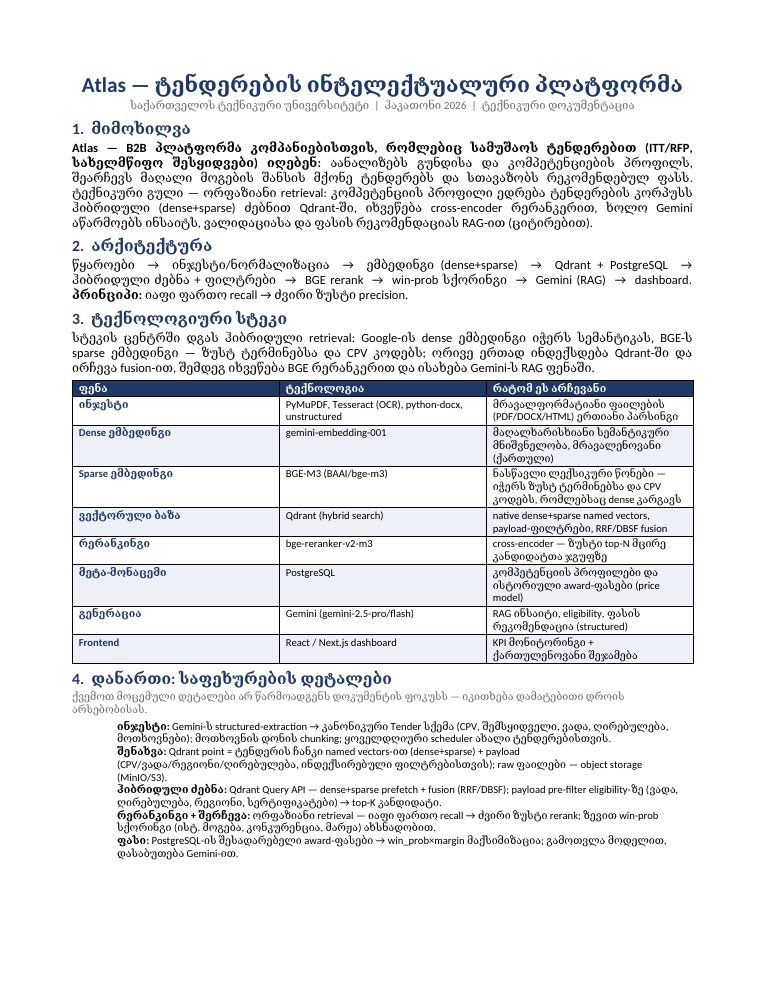

# Hackathon Technical Doc / ჰაკათონის ტექნიკური დოკუმენტი

A Claude **skill** that generates a one-page technical document (`.docx`) for any
project with a **locked, jury-consistent structure**. Every team produces the same
layout, so judges can compare projects fairly.

> Claude-ის **სქილი**, რომელიც ნებისმიერი პროექტისთვის ქმნის 1-გვერდიან ტექნიკურ
> დოკუმენტს (`.docx`) **ფიქსირებული, ჟიურისთვის თანმიმდევრული სტრუქტურით**. ყველა
> გუნდი ერთნაირ ლეიაუტს იღებს, ჟიური კი ადვილად ადარებს პროექტებს.



## What's inside / რა შედის

```
skill/
  SKILL.md             # the skill definition Claude reads
  generate_doc.py      # locked .docx generator (do not edit styling)
  example_content.json # a complete worked example
dist/
  hackathon-tech-doc.skill   # installable bundle (zip) for Cowork/Claude
examples/
  atlas-sample-output.docx   # sample rendered output
```

## Document structure (fixed) / დოკუმენტის სტრუქტურა (ფიქსირებული)

1. **Title block** — project title + `org | event | doc-kind` subtitle
2. **Overview** — what the product is + its technical core
3. **Architecture** — a text arrow-flow (`A → B → C …`) + one design principle
4. **Technology Stack** — narrative paragraph + a 3-column table (Layer · Technology · Why)
5. **Appendix** — short bold-labeled step details

Languages / ენები: Georgian (`ka`), English (`en`), or bilingual (`both`). The
section headings come from a fixed label set, so the structure is identical for
every team regardless of language.

## Install / დაყენება

**Cowork / Claude desktop:** open `dist/hackathon-tech-doc.skill` and click
**Save skill**. Then just ask Claude: *"create a technical doc for my project"*.

> **Cowork / Claude desktop:** გახსენი `dist/hackathon-tech-doc.skill` და დააჭირე
> **Save skill**-ს. შემდეგ უბრალოდ სთხოვე Claude-ს: *„შემიქმენი ტექნიკური დოკი ჩემს
> პროექტზე"*.

<<<<<<< HEAD
## Use without Claude (CLI) / გამოყენება CLI-ით

```bash
pip install python-docx --break-system-packages -q
cd skill
=======
## Browser only — no Claude desktop, no install / მხოლოდ ბრაუზერით

If a team has **no Claude desktop and no Python installed**, they can run everything
in the browser with **Google Colab** (free, account = any Google login):

> თუ გუნდს **არც Claude-ის დესკტოპი აქვს და არც Python დაყენებული**, ყველაფერი
> ბრაუზერში, **Google Colab**-ით კეთდება (უფასო, საჭიროა მხოლოდ Google ანგარიში):

1. Open <https://colab.research.google.com> → **New notebook**.
2. In the first cell, clone this repo and install the one dependency:
   ```python
   !git clone https://github.com/andriagv/hackathon-tech-doc-github.git
   %cd hackathon-tech-doc-github/skill
   !pip install python-docx -q
   ```
3. In a new cell, write your project content (copy the shape from
   `example_content.json`):
   ```python
   import json
   content = {
       "lang": "ka",
       "title": "ჩემი პროექტი",
       "org": "ჩემი გუნდი",
       "event": "Hackathon 2026",
       "overview": "**ერთი წინადადება პროდუქტზე.** დანარჩენი აღწერა...",
       "architecture_flow": ["წყარო", "დამუშავება", "ბაზა", "API", "UI"],
       "architecture_principle": "მოკლე პრინციპი.",
       "stack_summary": "სტეკის მოკლე აღწერა.",
       "stack_table": [
           ["Backend", "FastAPI", "სწრაფი async API"],
           ["DB", "PostgreSQL", "სანდო რელაციური ბაზა"],
           ["Frontend", "React", "კომპონენტური UI"]
       ],
       "appendix": ["ნაბიჯი 1: დეტალი.", "ნაბიჯი 2: დეტალი."]
   }
   json.dump(content, open("content.json", "w"), ensure_ascii=False, indent=2)
   ```
4. Generate the document:
   ```python
   !python generate_doc.py content.json my-project-technical-doc.docx
   ```
5. Download it: in Colab's left **Files** panel, open `hackathon-tech-doc-github/skill`,
   right-click `my-project-technical-doc.docx` → **Download**.

**Tip / რჩევა:** to fill `content` faster, paste the `example_content.json` format
plus your project description into regular **claude.ai (web)** and ask it to produce
a matching `content.json` — then drop the result into step 3.

## Use without Claude (CLI) / გამოყენება CLI-ით

```bash
git clone https://github.com/andriagv/hackathon-tech-doc-github.git
cd hackathon-tech-doc-github/skill
pip install python-docx --break-system-packages -q
>>>>>>> c7756f1 (Initial commit: hackathon-tech-doc skill)
# copy example_content.json, fill in your project, then:
python generate_doc.py content.json my-project-technical-doc.docx
```

### content.json fields

| field | required | notes |
|-------|----------|-------|
| `lang` | no | `"ka"` (default), `"en"`, or `"both"` |
| `title` | yes | project name |
| `org` | no | institution / team |
| `event` | no | e.g. "Hackathon 2026" |
| `overview` | yes | 3–4 sentences; `**bold**` the lead clause |
| `architecture_flow` | yes | array of pipeline stages → rendered as `A → B → C` |
| `architecture_principle` | no | one short sentence |
| `stack_summary` | no | one narrative paragraph above the table |
| `stack_table` | yes | array of `[layer, technology, why]` rows (5–9 ideal) |
| `appendix` | no | array of `"Label: text"` strings (3–6 ideal) |

## Consistency rules / თანმიმდევრობის წესები

Do **not** edit the styling in `generate_doc.py`, rename or add sections, or change
the table columns — that's what keeps every team's document looking the same. Keep
output to **one page**: shorten prose rather than shrinking fonts.

> **ნუ** შეცვლი სტილს `generate_doc.py`-ში, ნუ დაარქმევ/დაამატებ სექციებს და ნუ
> შეცვლი ცხრილის სვეტებს — სწორედ ეს უზრუნველყოფს ერთგვაროვან დოკუმენტებს. შეინარჩუნე
> **ერთი გვერდი**: ტექსტი მოამოკლე, შრიფტი ნუ დაამცირებ.

## License

MIT — see [LICENSE](LICENSE).
